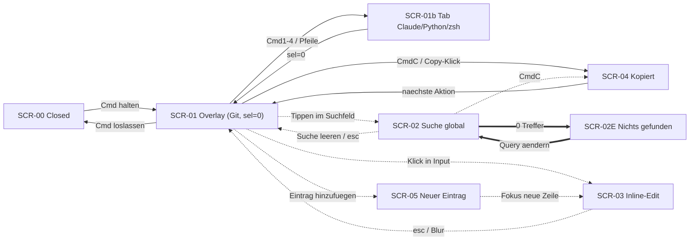

# 04 · Referenzen

## Prototyp (Verhalten und Optik maßgeblich)
- Claude Artifact (zwei Artboards: Reiter Git, Reiter Claude): https://claude.ai/artifact/JatsEaAAE3YxbgnGsDhktP

## Miro-Board „Hold Overlay – Board-Spezifikation"
- Board: https://miro.com/app/board/uXjVHky-9dQ=/
- Projektphasen 001–007: https://miro.com/app/board/uXjVHky-9dQ=/?moveToWidget=3458764684353235030
- SCR-Karten (Screens & States): https://miro.com/app/board/uXjVHky-9dQ=/?moveToWidget=3458764684351711841
- Interaktionsfluss (Connectors, farbcodiert): https://miro.com/app/board/uXjVHky-9dQ=/?moveToWidget=3458764684351833230
- Screen-/Verbindungsmatrix (Tabelle): https://miro.com/app/board/uXjVHky-9dQ=/?moveToWidget=3458764684351833251
- Mermaid-Quellcode des Flusses: https://miro.com/app/board/uXjVHky-9dQ=/?moveToWidget=3458764684351833242

## Interaktionsfluss (Mermaid, offline-Kopie)

## Design-Eckwerte (aus dem Artifact übernommen)
- Helles Panel #FBFBFD auf grauem Grund, Rahmen #D2D2D7, Trennlinien #E5E5EA, Fußleiste #F2F2F7
- Text #1D1D1F, Sekundärtext #6E6E73, Akzent #0064D2 (aktiver Reiter, Auswahl, Feedback)
- Systemfont für UI, Monospace (SF Mono) für Commands und Tastenkürzel
- Zeile: Beschreibung fest ~300 px · Command flexibel · Copy-Button 44 px; Ellipsis bei Überlauf

## Seed-Library für den Erststart
Inhalte 1:1 aus dem Artifact übernehmen (Reiter Git, Claude, Python, zsh mit ihren Gruppen). Bei Abweichungen gilt der aktuelle Stand des Artifacts, nicht diese Datei.
